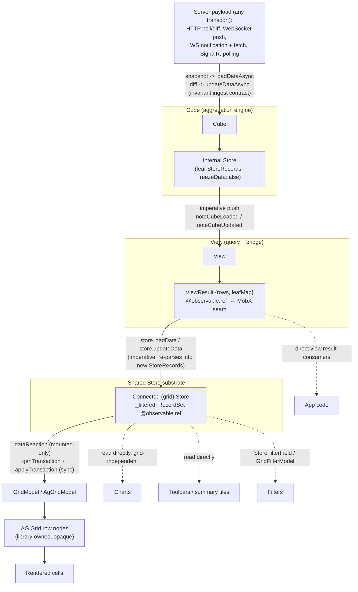
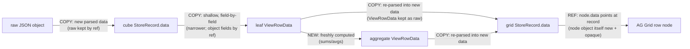

# Current-State Data Architecture (INV-01)

**Requirement:** INV-01
**Date:** 2026-06-28
**Source revision:** `develop` (commit `3e8d6ea`, dated 2026-06-27).
**Status:** Authoritative. This is the single current-state architecture document for the `hoist-react`
data layer. A reader needs only this document - plus the three linked companion deep-dives - to
understand how data flows from the server to a rendered grid cell today, where memory accumulates,
where MobX observes, and which boundaries the Phase 2 harness will instrument.

## What this document supersedes

This document **absorbs and supersedes** the earlier validation notes, which now stand as historical
backing only:

- [`KICKOFF-VALIDATION.md`](./KICKOFF-VALIDATION.md) - the terminology + architecture grounding pass
  that corrected the kickoff brief against source.
- [`validation/A-store-cube-view.md`](./validation/A-store-cube-view.md) - Store / Cube / View / Field /
  Aggregator API validation.
- [`validation/B-grid-mobx.md`](./validation/B-grid-mobx.md) - GridModel / AG Grid integration and MobX
  reactivity validation.
- [`validation/C-real-usage.md`](./validation/C-real-usage.md) - real production usage patterns.

The corrected facts those notes established are folded in below. The notes remain in the repository as
the source-cited record behind each correction, but no later phase needs to read them - this document
is the reference.

It also **integrates by reference and summary** the three Wave 1 deep-dives, rather than leaving them as
orphans:

- [`COPY-VS-REUSE.md`](./COPY-VS-REUSE.md) (INV-02) - object identity across the pipeline.
- [`MOBX-GRANULARITY.md`](./MOBX-GRANULARITY.md) (INV-03) - the reaction-granularity trace.
- [`TRANSPORT-INVENTORY.md`](./TRANSPORT-INVENTORY.md) (INV-04) - the transport / pattern inventory.

## Terminology

The canonical names, used consistently throughout (per the validated glossary):

`Store`, `StoreRecord`, `Field`, `StoreConfig`, `StoreTransaction`, `StoreChangeLog`, `processRawData` ·
`Cube`, `CubeConfig`, `CubeField`, `Aggregator` (abstract base; `AggregatorToken` for the built-in
shorthands) · `View`, `ViewConfig`, `Query`, `ViewResult`, `ViewRowData` · `GridModel`, `AgGridModel`,
`gridModel.agApi`, `ColChooserModel`, `GridFilterModel`, `StoreFilterField`. Groupings are
**dimensions**; selected outputs are **aggregated fields** (informally "measures"). Apps that are not
public are referred to generically; the only named applications are Hoist, Toolbox, and JobSite.

---

## Core artifacts

Hoist's data layer is built from four cooperating classes. Each is summarized below by responsibility,
key API, what it observes/exposes, and the validated corrections that change the naive mental model.

### Store

**Responsibility.** A `Store` is a container for `StoreRecord`s whose shape is defined by typed `Field`s
(`data/Store.ts:244`). It is the framework's AG-Grid-independent data substrate: it holds records, parses
raw inbound data, tracks local edits/dirty state, and applies a filter. It does **not** sort - sorting is
the grid's job (`validation/A-store-cube-view.md` §2.1; no sort API exists anywhere in `Store.ts`).

**Key API.**
- Ingest: `loadData(rawData)` (full replacement, `data/Store.ts:387-407`) and
  `updateData(rawData | StoreTransaction)` (incremental add/update/remove, `data/Store.ts:433`).
- Editing: `addRecords()`, `modifyRecords()`, `removeRecords()`, `revertRecords()`, with
  `isDirty` / `dirtyRecords` tracking (`data/Store.ts:560-714`).
- Filtering: `setFilter()` / `clearFilter()` / `refreshFilter()` with composable `Filter` types
  (`data/Store.ts:853-873`).
- Single inbound transform hook: `processRawData(raw)` - one arbitrary function, not a structured
  pipeline (`data/Store.ts:1146-1154`).

**What it observes / exposes.** The Store's observable data surface is the **filtered `RecordSet`**,
`_filtered`, an `@observable.ref` that is swapped wholesale (`data/Store.ts:307-308`). It is rebuilt by
`rebuildFiltered()` (`this._filtered = this._current.withFilter(this.filter)`, `data/Store.ts:1123-1126`).
Crucially, `rebuildFiltered()` is **not** driven by a MobX reaction on the filter - it is called
imperatively from every mutation and filter path (`loadData`, `updateData`, `setFilter`, etc.); there is
no `addReaction` on `this.filter` in the constructor (INV-03 §3, resolving validation open question #2).

**Validated corrections.** There is no `commitRecords()` method - commit semantics are achieved through
`updateData()`, and the Store's own term is `committedData` (`validation/A-store-cube-view.md` §2.1). Each
record retains a reference to the original `raw` object **and** owns a separately-parsed `data` object
(see Copy-vs-reuse below). A general Store defaults to `freezeData: true`; the Cube's internal store
deliberately sets it `false` (`data/cube/Cube.ts:150-151`).

### Cube

**Responsibility.** A `Cube` is the aggregation engine. It is a **distinct class** from `Store`
(`data/cube/Cube.ts:120`) that **wraps a `Store` internally** to hold flat, leaf-level records
(`@managed store: Store`, constructed in the Cube constructor, `data/cube/Cube.ts:123,146-153`). It runs
queries - filter + grouping (dimensions) + selected aggregated fields - and recomputes aggregates
incrementally as data changes.

**Key API.**
- Ingest: `loadDataAsync(rawData, info?)` (full snapshot) and `updateDataAsync(rawData | StoreTransaction,
  infoUpdates?)` (incremental diff) - thin wrappers over the internal `Store` primitives
  (`data/cube/Cube.ts:282-286, 299-314`).
- Querying: `executeQuery(query)` for a one-shot result and `createView({query, stores, connect})` for a
  durable, optionally-connected View (`data/cube/Cube.ts:207-245`).
- Local edits: `modifyRecordsAsync()` for inline-edit scenarios against cube-backed data
  (`data/cube/Cube.ts:328-334`).
- Metadata: an observable `info` blob carried alongside each load.

**What it observes / exposes.** The Cube does **not** observe its internal store via MobX. Its connected
views live in a plain `Set<View>` (`Cube._connectedViews`, `data/cube/Cube.ts:131`). On every ingest it
**imperatively fans out** to each connected view - `loadDataAsync` calls `view.noteCubeLoaded()` and
`updateDataAsync` calls `view.noteCubeUpdated(changeLog)`, both via `forEachAsync` to avoid locking the
browser when many expensive views are attached (`data/cube/Cube.ts:285, 312`; INV-03 §1).

**Validated corrections.**
- **No built-in weighted-average aggregator.** The built-in `AggregatorToken`s are `SUM, AVG, MIN, MAX,
  UNIQUE, LEAF_COUNT, CHILD_COUNT, NULL, SINGLE, SUM_STRICT, AVG_STRICT`. Weighted-average-by-another-field
  requires a custom subclass of the abstract `Aggregator` class - it is an extension point, not a runtime
  config option (`validation/A-store-cube-view.md` §3.1). This matters for any later feature analysis:
  runtime user-chosen weighted aggregation is genuinely new work.
- **The Cube wraps a Store** rather than being one (`data/cube/Cube.ts:123`).
- **The Cube is slightly editable**: `modifyRecordsAsync()` supports in-place field edits, so
  "read/aggregate-only" is an oversimplification (`validation/A-store-cube-view.md` §3.2).

### View

**Responsibility.** A `View` is the durable bridge between a `Query` and one or more connected `Store`s. It
holds the query, recomputes a result when its parent Cube notifies it, and pushes that result into its
connected stores.

**Key API.**
- Construction: via `Cube.createView({query, stores?, connect?})`. When `connect: true`, the View is added
  to the Cube's `_connectedViews` set and recomputes on every cube change (`data/cube/Cube.ts:231-244`).
- Store wiring: `setStores([...])` to (re)point the View at its downstream stores.
- Notification entry points: `noteCubeLoaded()` (full) and `noteCubeUpdated(changeLog)` (incremental),
  both `@action`s that funnel to `fullUpdate()` or the `dataOnlyUpdate()` fast path
  (`data/cube/View.ts:263-282`).

**What it observes / exposes.** `View.result` is the **first MobX observable in the entire path** - an
`@observable.ref` of type `ViewResult {rows: ViewRowData[], leafMap: Map<...>}` (`data/cube/View.ts:62-65,
109-110`). It is reassigned to a brand-new object on every update inside `updateResults()`
(`data/cube/View.ts:335-341`). This is the integration seam any reactivity bridge must target (INV-03 §2,
resolving the kickoff brief's imagined cube-level observable).

**Validated corrections.**
- **A View feeds one OR MORE stores.** `ViewConfig.stores?: Store[] | Store` - one query result can fan
  out to multiple downstream grids/stores simultaneously (`validation/A-store-cube-view.md` §3.4).
- **The View loads its stores imperatively, not by observing its own result.** Connected stores are loaded
  inside the same update via `loadStores()` -> `store.loadData(rows)` (full path) or
  `store.updateData({update})` (data-only path), running in parallel with the `@observable.ref result` swap
  (`data/cube/View.ts:316-333`; INV-03 §2). A grid backed by a cube reaches AG Grid through the store-load
  path, not by observing `view.result`.
- **A connected store may not use `reuseRecords: true`** - the View mutates the `ViewRowData` objects it
  feeds downstream in place during `dataOnlyUpdate()`, so reference-identity-based reuse would silently
  skip real data changes (`data/cube/View.ts:554-558`; COPY-VS-REUSE §3).
- A View also implements the filter-bind-target interfaces, so it can serve as the source for grid header
  filter dropdowns, not just a Store (`validation/A-store-cube-view.md` §4.6).

### GridModel

**Responsibility.** `GridModel` is the model behind a Hoist grid. It owns the grid's `Store`, column
definitions, sort/group/selection state, and exposes the AG Grid API handle. It proxies the live AG Grid
API as `gridModel.agApi` (which proxies `agGridModel.agApi`).

**Key API.**
- Store binding: pass a `Store` instance, or a `StoreConfig` and the GridModel creates and `markManaged`s
  its own (`validation/A-store-cube-view.md` §confirmed). `GridModel.loadData()` / `updateData()` proxy to
  the grid's own Store.
- Column state: managed via `columnState`; the `ColChooserModel` operates on **column state**, not the
  store (`validation/B-grid-mobx.md`).
- Filtering: `GridFilterModel` / `StoreFilterField` operate at the **store** level, and
  `GridFilterModel.bind` can target a Store **or** a Cube View - the explicit shared-dataset mechanism.

**What it observes / exposes.** Critically, the AG-Grid-driving reactions do **not** live on `GridModel`.
They live in `GridLocalModel`, the component-internal model defined inside `Grid.ts` and created via
`useLocalModel(GridLocalModel)` in the `Grid` render function (`cmp/grid/Grid.ts:109`). All of them are
registered in `GridLocalModel.onLinked()` (`cmp/grid/Grid.ts:186-203`), so they are **mounted-only**: they
exist while the grid component is mounted and are disposed on unmount. `GridModel` itself holds essentially
one always-on reaction (an editing-mode debounce) (INV-03 §4, §6).

**Validated corrections.**
- **Updates are synchronous.** The data path drives `agApi.applyTransaction(transaction)` synchronously
  (`cmp/grid/Grid.ts:693`); there is **no** `applyTransactionAsync` and **no explicit batching layer** -
  the only coalescing is implicit MobX action batching (INV-03 §5).
- **The chooser is column-state; the filter is store-level** (`validation/B-grid-mobx.md`).
- Stable row identity is `getRowId: ({data}) => data.agId` (`cmp/grid/Grid.ts:213`), where `agId` is a
  stable per-`StoreRecord` id.

---

## The shared-store contract

The single most important architectural property of this layer - and the seam later phases must protect -
is that **the `Store` is an AG-Grid-independent substrate**. A `Store` (or a Cube `View` feeding one) holds
records that any number of consumers read independently of the grid: charts read the same records,
toolbars and summary tiles read them, `StoreFilterField` filters them, and a `GridFilterModel` can bind its
header filters to the Store or directly to a Cube View. Confirmed in practice at 10+ widget types per cube
in real applications, and multiple cubes per app (`validation/A-store-cube-view.md` §refinements,
`validation/C-real-usage.md`).

This is central to Hoist's value: the data layer is a reactive, framework-owned model that many UI surfaces
share, rather than data bound to a single grid widget. It is also the source of a real tension this project
must weigh - "just use AG Grid's own features" (server-side row model, AG Grid's own aggregation, AG Grid
filters) would collapse the substrate into the grid and forfeit the shared-store contract. Any Data 2.0
candidate must preserve a framework-owned, grid-independent data surface that non-grid consumers read, or it
breaks the contract that makes Hoist's data layer valuable.

---

## Two production wiring patterns

There are two real patterns for connecting a Cube to a grid (`validation/C-real-usage.md` §5.1;
`KICKOFF-VALIDATION.md` refinements). Both are in production use; the choice is about how much the app wants
the framework to manage.

### (a) Declarative connected View - `createView({connect: true})` + `setStores`

The app creates a connected View whose result is pushed automatically into one or more grid stores. The
framework owns the recompute-and-load lifecycle: every `cube.updateDataAsync()` fans out to the View, which
recomputes and loads its connected stores with no app code in the loop.

```typescript
// declarative: the framework keeps the grid's store in sync with the cube
const view = cube.createView({
    query: {dimensions: ['region', 'desk'], fields: ['pnl', 'qty'], includeRoot: true},
    stores: [gridModel.store],
    connect: true            // View joins cube._connectedViews; recomputes on every cube change
});
// later, to re-point the same View at different stores:
view.setStores([otherGridModel.store]);
```

**Preferred when** the app wants the standard, framework-managed flow: a stable query whose results should
always track the cube, feeding one or more grids/charts. This is the default recommendation.

### (b) Manual MobX reaction - `cube.records` -> `executeQuery()` -> `gridModel.loadData()`

The app drives the recompute itself: a MobX reaction observes the cube's records (or another trigger), runs
a one-shot `cube.executeQuery()`, and feeds the result into a grid store via `gridModel.loadData()`. The
View is not connected; the app owns the loop.

```typescript
// manual: the app decides when to re-query and reload
this.addReaction({
    track: () => cube.records,
    run: () => {
        const result = cube.executeQuery({
            dimensions: ['region'],
            fields: ['pnl'],
            includeRoot: true
        });
        gridModel.loadData(result.rows);
    }
});
```

**Preferred when** the app needs custom control over *when* and *what* it re-queries - e.g. debouncing,
deriving the query from other observable state, post-processing rows before load, or driving multiple grids
from one cube with per-grid query variation. It trades framework convenience for explicit control.

Both patterns land at the same downstream contract: a store load (`loadData` / `updateData`) that a mounted
grid translates into a synchronous AG Grid transaction. The wiring choice changes who triggers the recompute,
not where data lands.

---

## End-to-end data flow

Following a single dataset from the wire to a rendered cell, the current architecture runs as a fixed
pipeline regardless of which transport delivered the data:

1. **Server payload arrives.** JSON over HTTP (poll/diff or polling), a WebSocket data-push payload, a
   WebSocket "data ready" notification that triggers an HTTP fetch, or an app-layer SignalR adapter - every
   transport resolves to one of two ingest calls. This is the **invariant ingest contract**: a full snapshot
   lands at `Cube.loadDataAsync()` and an incremental diff lands at `Cube.updateDataAsync()`; everything above
   that line is an interchangeable adapter (see [Transport inventory](#transport-inventory-inv-04) and
   [`TRANSPORT-INVENTORY.md`](./TRANSPORT-INVENTORY.md) for the full snapshot-vs-diff fork).

2. **Cube ingests into its internal Store.** `loadDataAsync` / `updateDataAsync` delegate to the internal
   `Store.loadData()` / `Store.updateData()`. The Store **mints `StoreRecord`s**: each raw object is parsed
   through `processRawData` (optional) then `parseRaw()`, which allocates a fresh `data` object while keeping
   the original `raw` by reference (`data/Store.ts:1156-1165`). The Cube's store is `freezeData: false` so
   leaf `data` can be mutated in place on the incremental fast path.

3. **Cube pushes to connected Views (imperative).** After ingest, the Cube iterates `_connectedViews` and
   calls `view.noteCubeLoaded()` (full) or `view.noteCubeUpdated(changeLog)` (diff) via `forEachAsync`. There
   is no MobX observable at this boundary - it is a deliberate imperative fan-out (`data/cube/Cube.ts:285,
   312`).

4. **View recomputes a `ViewResult`.** The View either does a `fullUpdate()` (regenerate the row tree:
   leaf rows shallow-copied from cube records, aggregate rows freshly computed) or, when only field values
   changed under simple aggregators, takes the `dataOnlyUpdate()` fast path (mutate leaf and ancestor row
   data in place). Either way it assigns a brand-new `result` object - `this.result = {rows, leafMap}` - to
   the `@observable.ref result` (`data/cube/View.ts:335-341`). **This `result` write is the MobX seam.**

5. **Connected Store(s) load.** In the same update, the View loads its connected stores imperatively:
   `store.loadData(rows)` on the full path or `store.updateData({update})` on the data-only path
   (`data/cube/View.ts:316-333`). Each connected (grid) store re-parses every `ViewRowData` into a new
   `StoreRecord` with a new (frozen, by default) `data` object, keeping the `ViewRowData` as `raw`. The
   store then rebuilds `_filtered` (`@observable.ref` RecordSet) imperatively via `rebuildFiltered()`.

6. **Grid reaction translates to a synchronous AG Grid transaction.** A mounted grid's
   `GridLocalModel.dataReaction` tracks `store._filtered`. When the RecordSet ref swaps, `syncData()` runs
   `genTransaction()` - a per-record three-way diff by `agId` - and applies it **synchronously** via
   `agApi.applyTransaction(transaction)` (`cmp/grid/Grid.ts:693`). On the first non-empty load it instead
   does a full `agApi.updateGridOptions({rowData})` (`cmp/grid/Grid.ts:696`).

7. **AG Grid renders.** AG Grid builds its own row-node objects, each referencing a `StoreRecord` as
   `node.data` keyed by `agId`; it reads field values off the record to render cells.

The full chain from a `_filtered` swap to the applied AG Grid transaction is synchronous and runs on the
main thread inside a mounted grid component. The only coalescing is implicit MobX action batching - there is
no application-level queue, throttle, or async-transaction layer (see
[MobX reaction granularity](#mobx-reaction-granularity-inv-03) and
[`MOBX-GRANULARITY.md`](./MOBX-GRANULARITY.md)).

---

## Diagrams

### Component / data-flow

How a datum moves through the layer, and where non-grid consumers branch off the shared Store.



### Reactivity sequence - an incremental update

How a single incremental update propagates, classifying each hop's granularity. Note the two imperative
pushes (Cube->View, Store rebuild) bracketing the two MobX seams (`View.result`, `Store._filtered`), and the
synchronous, per-record AG Grid transaction at the end.

```mermaid
sequenceDiagram
    participant T as Transport adapter
    participant C as Cube
    participant V as View
    participant S as Connected Store
    participant R as dataReaction (mounted)
    participant A as AG Grid (agApi)

    T->>C: updateDataAsync(diff)
    Note over C: store.updateData() -> StoreChangeLog<br/>(internal store mutates leaf data in place)
    C->>V: noteCubeUpdated(changeLog)  [imperative, no MobX]
    alt simple aggregators, values-only change
        Note over V: dataOnlyUpdate(): mutate leaf + ancestor<br/>row data in place
    else structural change
        Note over V: fullUpdate(): regenerate row tree
    end
    V->>V: this.result = {rows, leafMap}  [@observable.ref - MobX seam, whole-result ref]
    V->>S: store.updateData({update})  [imperative; re-parses ViewRowData into new StoreRecords]
    Note over S: rebuildFiltered():<br/>_filtered = _current.withFilter(filter)<br/>[@observable.ref - MobX seam, whole-RecordSet ref]
    S-->>R: _filtered ref swap fires dataReaction (whole-reference granularity)
    R->>R: genTransaction(newRs, prevRs)  [per-record three-way diff by agId]
    R->>A: agApi.applyTransaction(transaction)  [SYNCHRONOUS, per-record add/update/remove]
    A->>A: update row nodes, render
```

### Copy-vs-reuse along the pipeline

Annotating each transition edge as a new allocation ("copy") vs. a shared reference ("ref"). This is the
identity map that the heap-attribution work in Phase 2 reasons from (full detail in
[`COPY-VS-REUSE.md`](./COPY-VS-REUSE.md)).



---

## Integrated findings

The three Wave 1 deep-dives resolve the empirical unknowns carried into Phase 1. Each is summarized here and
linked for full source-cited detail.

### Copy-vs-reuse (INV-02)

Full doc: [`COPY-VS-REUSE.md`](./COPY-VS-REUSE.md).

- A single leaf datum surfaced through a cube-backed connected grid exists as **at least four distinct
  parsed/record representations** concurrently: the raw object, the cube `StoreRecord.data`, the leaf
  `ViewRowData`, and the grid `StoreRecord.data` - plus the AG Grid node that references the last of those,
  plus retained `raw` references at each Store boundary.
- **Every `Store` boundary re-parses** into a new `data` object via `parseRaw` (Transitions 1 and 4); the
  `raw` object is retained by reference alongside.
- The **View -> leaf `ViewRowData`** edge is a shallow per-field copy (Transition 2); **aggregate rows are
  genuinely new** computed allocations with no leaf counterpart (Transition 3), and are cached/reused across
  query runs when their children are unchanged.
- The **`StoreRecord` -> AG Grid node** edge is **by reference** (no field-data copy), but AG Grid's own
  node/group/index structures are a real, **opaque, library-owned allocation**. This edge is the Phase 2
  heap-attribution boundary between "Hoist data layer" and "grid library."
- Object-valued fields are copied **by reference** at every transition (no transition deep-clones), so they
  are shared; the net heap impact is a measurement question.

### MobX reaction granularity (INV-03)

Full doc: [`MOBX-GRANULARITY.md`](./MOBX-GRANULARITY.md).

- **Observation is at whole-reference granularity.** The two MobX seams - `View.result` (`@observable.ref`,
  reassigned to a new `{rows, leafMap}`) and `Store._filtered` (`@observable.ref` RecordSet, reassigned in
  `rebuildFiltered()`) - fire once per whole-object ref swap, never per row.
- **Per-record work appears only inside the AG Grid transaction** (`genTransaction` three-way diff ->
  `applyTransaction`) and on the View's data-only store-update path.
- **`applyTransaction` is synchronous** with no `applyTransactionAsync` and no explicit batching/debounce
  layer (`cmp/grid/Grid.ts:693`); the only coalescing is implicit MobX action batching.
- **Cube->View and Store-mutation->`rebuildFiltered` are imperative pushes**, not MobX-observed.
- **The grid-driving reactions are mounted-only** (registered in `GridLocalModel.onLinked`, gated on
  `agApi`/`isReady`). An unmounted grid applies no transactions; on remount, `prevRs` resets and the grid
  takes a full `updateGridOptions({rowData})` replacement rather than a delta.

### Transport inventory (INV-04)

Full doc: [`TRANSPORT-INVENTORY.md`](./TRANSPORT-INVENTORY.md).

- Five patterns the layer must support: **HTTP snapshot/diff (poll-then-diff)**, **WebSocket data push**
  (first-class via `XH.webSocketService`; demonstrated in the Toolbox portfolio example; strategically
  important and not represented in the local samples), **WebSocket-as-notification** (socket carries
  metadata; data arrives over a follow-on HTTP fetch), **SignalR** (client-owned transport with no
  Hoist-native client - bridged at the app/service layer), and **polling** (degenerate HTTP case).
- **The invariant ingest contract:** regardless of transport, ingest collapses to exactly two operations -
  a full snapshot to `Cube.loadDataAsync()` (-> `Store.loadData()`) and an incremental diff to
  `Cube.updateDataAsync()` (-> `Store.updateData()`). Transport governs *how data arrives and who controls
  timing*; it does not change *where data lands* or *the shape ingest accepts*.
- This makes transport a **clean experimental knob** for the harness (HARN-02): a "WebSocket push" run and a
  "poll-then-diff" run differ only in the adapter that invokes the two entry points; everything below is
  held constant. Any Data 2.0 path must preserve the same two-operation contract to stay transport-agnostic.

---

## Phase 2 instrumentation points

This section is the bridge into Phase 2: the concrete, **attributable boundaries** where the harness will
hook heap and timing. Each is named at a real source seam, with what it measures and the HARN requirement it
serves (HARN-03 boundary instrumentation into OTel; HARN-04 heap attribution by layer; HARN-05 compute-vs-
bridge split with median + p95).

| # | Boundary (source seam) | What it measures | HARN tie-in |
|---|------------------------|------------------|-------------|
| 1 | **Cube ingest** - `Cube.loadDataAsync` / `updateDataAsync` (`data/cube/Cube.ts:282, 299`) | Inbound timing and record counts; snapshot vs. diff cost; throughput of the ingest call itself | HARN-03 (boundary timing), HARN-05 (compute) |
| 2 | **Cube -> View imperative push** - `noteCubeUpdated` (`data/cube/Cube.ts:312`, `data/cube/View.ts:263-282`) | Re-aggregation compute boundary: `fullUpdate()` (full row-tree regen) vs. `dataOnlyUpdate()` (in-place) compute time | HARN-03, HARN-05 (compute) |
| 3 | **`View.result` assignment** - the `@observable.ref` write in `updateResults()` (`data/cube/View.ts:335-341`) | The MobX seam: result-size attribution (row count, leaf+aggregate `ViewRowData` footprint); reaction-fire frequency | HARN-04 (intermediate view-result heap), HARN-03 |
| 4 | **Store load / `_filtered` rebuild** - `Store.loadData` / `updateData` -> `rebuildFiltered()` (`data/Store.ts:387, 433, 1123-1126`) | Grid-store record allocation boundary: new `StoreRecord` + `data` allocations, RecordSet rebuild cost | HARN-04 (grid store records), HARN-05 (compute) |
| 5 | **Grid `dataReaction` -> `genTransaction` -> `applyTransaction`** (`cmp/grid/Grid.ts:357-366, 649-678, 693`) | Main-thread transaction cost: per-record diff time, then the JS<->AG Grid bridge cost of the synchronous `applyTransaction` call | HARN-05 (the compute-vs-bridge split lives here), HARN-03 |
| 6 | **Heap-attribution layers** (from COPY-VS-REUSE Transition map) | Resident heap split across: cube store records, grid store records, intermediate `ViewResult` rows (incl. row cache), and AG Grid internal nodes (opaque - measured, not read) | HARN-04 (heap attribution by layer, with a non-cross-origin-isolation fallback) |

Notes for the harness:

- **Boundary 5 is the compute-vs-bridge split.** `genTransaction()` is Hoist-side compute (measurable in
  JS); `applyTransaction()` crosses into AG Grid and its true cost is partly opaque - HARN-05 must separate
  the diff compute from the bridge/apply cost and report median + p95 with a forced-GC steady-state protocol.
- **Boundary 6's AG Grid layer is opaque.** The `StoreRecord` -> AG Grid node edge is the heap-attribution
  boundary between Hoist data and the grid library; AG Grid internals must be **measured**, not read from
  source (COPY-VS-REUSE Transition 5).
- **Instrument at boundaries, not per-micro-op** (HARN-03). The whole-reference MobX granularity (INV-03)
  makes this natural: boundaries 3 and 4 fire once per ref swap, so hooking them gives clean per-update
  attribution without per-record instrumentation noise.
- **Mounted-only caveat.** Boundary 5 only fires while the grid is mounted; the harness must account for the
  remount full-replacement path separately from steady-state delta cost.

---

## Open questions carried forward

Consolidated source-inconclusive items from the three companion docs, now Phase 2 measurement targets:

1. **AG Grid internal node footprint** - per-row nodes, grouped-grid group nodes, and AG Grid's internal
   indexes are library-owned and opaque; size and growth-with-rows must be measured (COPY-VS-REUSE Q1, the
   Transition 5 / Boundary 6 target).
2. **Net heap of object-valued fields** - source shows they are shared by reference at every transition, but
   the aggregate impact in real datasets (how many fields are object-valued, whether any consumer mutation
   forces divergence) is empirical (COPY-VS-REUSE Q2).
3. **`reuseRecords` / `freezeData` effect in practice** - how often real apps reference-reuse records across
   loads, and thus how much Transition-1 copying is actually avoided and how it changes the `update`-array
   size in `genTransaction` (COPY-VS-REUSE Q3, MOBX-GRANULARITY Q5).
4. **Row-cache and `committedData` retention** - steady-state size of `View._rowCache`, and the prevalence
   and heap impact of dirty/edited records where `committedData` diverges from `data` (COPY-VS-REUSE Q4, Q5).
5. **Does MobX action batching actually coalesce rapid updates?** - no explicit queue exists, and `Cube` fans
   out to views with `forEachAsync` (async), so whether a burst collapses into one `syncData()` run or fires
   `dataReaction` N times is empirical (MOBX-GRANULARITY Q1).
6. **`genTransaction` and synchronous `applyTransaction` cost at scale** - main-thread cost as a function of
   row count and churn rate, and whether `applyTransactionAsync`/chunking would meaningfully reduce blocking
   under high update frequency (MOBX-GRANULARITY Q2, Q3).
7. **Remount full-replacement cost** - remount resets `prevRs` and forces a full `updateGridOptions`
   replacement; the cost for large grids on dashboard/tab-switch remounts is a distinct target
   (MOBX-GRANULARITY Q4).

---

## References

- Source (commit `3e8d6ea`, `develop`): `data/Store.ts`, `data/cube/Cube.ts`, `data/cube/View.ts`,
  `data/cube/LeafRow.ts`, `data/cube/BaseRow.ts`, `data/cube/AggregateRow.ts`, `data/StoreRecord.ts`,
  `cmp/grid/Grid.ts`, `cmp/grid/GridModel.ts`, `cmp/ag-grid/AgGridModel.ts`, `svc/WebSocketService.ts`.
- Companion deep-dives: [`COPY-VS-REUSE.md`](./COPY-VS-REUSE.md) (INV-02),
  [`MOBX-GRANULARITY.md`](./MOBX-GRANULARITY.md) (INV-03),
  [`TRANSPORT-INVENTORY.md`](./TRANSPORT-INVENTORY.md) (INV-04).
- Historical backing: [`KICKOFF-VALIDATION.md`](./KICKOFF-VALIDATION.md),
  [`validation/A-store-cube-view.md`](./validation/A-store-cube-view.md),
  [`validation/B-grid-mobx.md`](./validation/B-grid-mobx.md),
  [`validation/C-real-usage.md`](./validation/C-real-usage.md).
